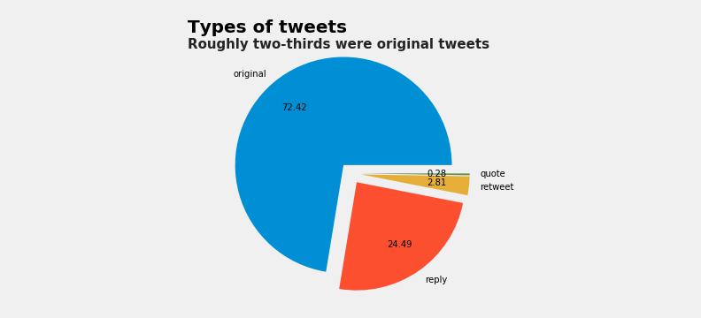
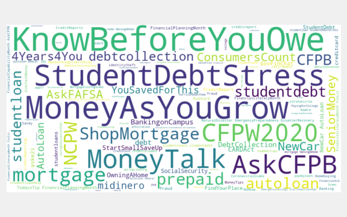

# CFPB Twitter Analysis

The project examines all tweets from February 3, 2011 to October 8, 2020 from the following Twitter page:

 - **[CFPB](https://twitter.com/CFPB?ref_src=twsrc%5Egoogle%7Ctwcamp%5Eserp%7Ctwgr%5Eauthor)**

**Data Sources**

This project analyzes the Consumer Financial Protection Bureau's (CFPB) Twitter data. The CFPB Twitter data was collected and acquired from the [Social Feed Manager](https://library.gwu.edu/scholarly-technology-group/social-feed-manager).

## Analysis and Visualization

### Tweet type

Based on the pie chart above, we can see that roughly two-thirds of the tweets from the @CFPB page were original tweets. Almost one-third were replies to others, only a very small percentage (2.81%) were retweets, and 0.28% were quotes. 

### Hashtags

The word cloud visually shows the frequency of the used hashtags from the Twitter dataset. #KnowBeforeYouOwe, #MoneyAsYouGrow, and #StudentDebtStress were most frequently used and likely point toward their focus as an organization, such as about thinking before borrowing, regarding student debt, and saving up money. They were closely trailed by #MoneyTalk, #AskCFPB, and #CFPW2020.

### Days of week

The bar graphs give an overview of the activity based on the days of the week. The weekend was clearly not as active when compared to Tuesday-Thursday. Furthermore, the retweet and quote id were the least active, overall, particularly on Sunday.

Overall, the top 10 hashtags account for around 22% of the total hashtags. The hashtags in the "others" (those below the top 10) account for around 78% of the hashtags. 

Among these top 10 hashtags only, #MoneyAsYouGrow accounts for around 18%, the hashtags #knowbeforeyouowe with regards to #mortgages accounts for around 16%, and #KnowBeforeYouOwe for around 10%. 

Consumers often have complaints about the credit bureaus or large banks. In fact, companies such as Equifax have gone through very public issues like the 2017 data breach, which may have been reflected in this dataset. After checking to see how often there were mentions of "Equifax," "JPMorgan," "Experian," "Transunion," and "Capital One," it was not surprising to see that Equifax was holding the number one spot among these companies, representing around 56% of the mentions among these. Another credit agency called Experian was in second, followed by JPMorgan with around 14%. This is followed by another credit agency called Transunion with almost 9%, and then Capital One with around 7%.

Cleaning and preparing the data such as through the use of stop words allows us to get a more accurate understanding of the data and text itself. Not surprisinly, the most common text appears to be about submitting complaints which is expected since the CFPB has a very large complaints database that is regularly updated and consulted. What is interesting is that phrases such as "thank," "reach," "contact," "share," and "submit" are engaging and clear calls to actions, signaling that the CFPB appear to be trying to engage with their audience. 

### Number of tweets

The year 2018 had the most number of tweets, overall. Also, the year 2020 had the lowest number of tweets when comparing from 2015 to today. In terms of favorited tweets, 2016 overwhelmingly had the most when compared to the whole time period between 2011 to 2020. In contrast, the year 2011 had the lowest number of favored tweets and this value has never been as low as that after, but rather, in general, has only increased. The year 2014 to 2016 saw a very sharp and significant hike in the number of favorited tweets. With regards to the retweets, it is the most unstable metric, having reached its lowest point in 2011, its highest in 2016, and shifting in between. 

### Retweets

The table shows some interesting information about the different retweets metrics. For example, the @fema retweet seems to have been the best-performing one. There was one RT (tweet count) of @fema which garnered 1,991 retweets, the highest value, giving it a very impressive performance and competitive average over the others. 

The scatterplot depicts the relation between the number of times a specific Twitter handle tweeted, and the number of retweets. As noted above, @fema did very well, having a very low tweet count but a high number of retweets. @CFPBMilitary performed pretty poorly since it had a relatively high tweet count despite a fairly low retweet count in comparison. 

    RT @fema: We have created a rumor control page for Hurricane #Florence that will be updated regularly. During disasters, it’s critical to a…
    
    RT @CFPBDirector: Busy day at the @CFPB. Digging into the details. https://t.co/yfs0gmh28F
    
    RT @Readygov: Prepare your home before a hurricane arrives:  🚗 Fill your car up with gas. ⛱ Bring outdoor furniture in and secure items out…
    
    RT @SBAgov: REMINDER: The deadline for SBA to approve #PaycheckProtectionProgram loan applications is TOMORROW.   👇 Find a lender and apply…
    
    When it comes to #mortgages, take your time, ask questions and #knowbeforeyouowe. https://t.co/UUaGyWDbzk
    
    When it comes to #mortgages, take your time, ask questions and #knowbeforeyouowe. https://t.co/UUaGyWDbzk
    
    If you have been affected by Hurricane #Harvey, we have resources to help you protect and rebuild your finances. https://t.co/Bdhnes6FWD https://t.co/SJ1qjf9Tvc
    
    RT @FTC: FTC warns hurricane victims about flood insurance robocall scam: https://t.co/mLNaukeu2O #Harvey #HurricaneHarvey #ScamAlert https…
    
    RT @SBAgov: REMINDER: The deadline for SBA to approve #PaycheckProtectionProgram loan applications is TOMORROW.   👇 Find a lender and apply…
    
    RT @SBAgov: #ICYMI: This morning, the #PaycheckProtectionProgram began accepting new loan applications in response to the Paycheck Protecti…
    

## Conclusion

The @CFPB Twitter page includes all tweets from early February 2011 to October 2020. The page's tweet breakdown is around 75% original tweets, followed in second by replies. The use of hashtags such as #KnowBeforeYouOwe, #MoneyAsYouGrow, and #StudentDebtStress signal to us that knowing more about money, saving up, and handling student stress due to debt are topics that are brought up more often in their posts. The account also appears to be more busy during the week, particularly around Tuesday-Thursday and has very low activity on the weekends, particularly Sunday.

The most common words in the twitter dataset were calls to action (action-oriented) and include words such as "help," "thank," "complaint", "share," "learn," and "submit." Regarding the different types of tweets, favorite, retweet, and tweet, the years 2014 to 2016 were the best years overall, with 2016 breaking records and reaching its peak in terms of the number of favorited tweets and retweets. The frequency of tweets that are retweets appear to be the most "volatile" with more sudden changes and not a very clear trend. In 2020, however, the retweets and favorited tweets have been slighlty declining and look like they could continue along that trend. 

Overall, the twitter page could do better, particularly with regard to its own twitter activity since the metrics that have done the best are those that are retweets of others rather than those done by the CFPB themselves. The best performing one was a retweet from @FEMA regarding hurricane Florence. In fact, among the top 10 best performing retweet types, four of them mentioned hurricanes. The paycheck protection program (often mentioned along with @SBAgov) comes in second place, which is expected given the pandemic. 
